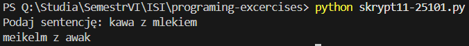
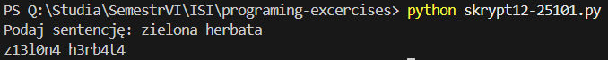
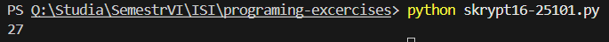
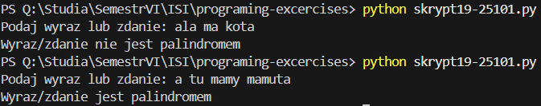
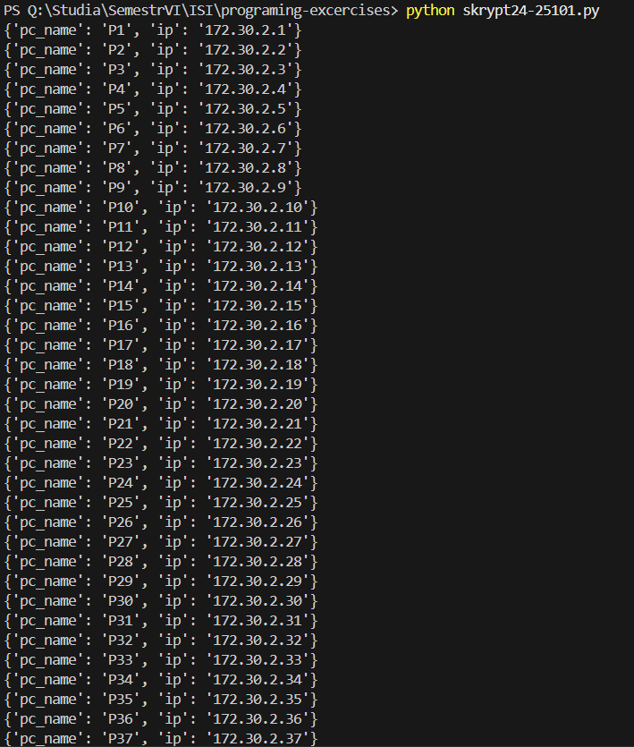

# TASK-01
``` def spr1(dane: str) -> str:
   if dane and isinstance(dane[0], str) and dane[0].isdigit():
      return True
   else:
      return False

def spr2(dane: str) -> str:
   if dane and dane[0].isdigit():
      return True
   else:
      return False

if __name__ == '__main__':
   dane = input("Podaj dowolny znak: ")
   
   if spr1(dane):
      print("Znak jest liczbą")
   else:
      print("Znak nie jest liczbą")

   if spr2(dane):
      print("Znak jest liczbą")
   else:
      print("Znak nie jest liczbą")
```


[skrypt01-25101.py](./skrypt01-25101.py)

# TASK-02
```
def spr(dane: str) -> str:
    if len(dane) >= 2 and all(znak.isdigit() for znak in dane):
        return True
    else:
        return False

if __name__ == '__main__':
    dane = input("Podaj ciąg znaków ")
    if spr(dane):
        print("Ciąg jest liczbą")
    else:
        print("Ciąg nie jest liczbą")
```


[skrypt02-25101.py](./skrypt02-25101.py)

# TASK-03
```
def szukanie():
    dane = "To jest długi ciąg znaków"
    #Wyszukjemy wpierw literę, potem wyraz, a na koniec coś czego nam nie znajdzie
    indeks1 = dane.find("z")
    indeks2 = dane.find("ciąg")
    indeks3 = dane.find("b")

    print(indeks1)
    print(indeks2)
    print(indeks3)

if __name__ == '__main__':
    szukanie()
```


[skrypt03-25101.py](./skrypt03-25101.py)

# TASK-04
```
def szukanie(dane: str, szukana: str) -> str:
    lista_wyrazow = dane.split()
    indeksy = [i for i, wyraz in enumerate(lista_wyrazow) if wyraz == szukana]
    if not indeksy:
        indeksy = -1
    print(szukana)
    print(indeksy)

if __name__ == '__main__':
    dane = "banan jabłko gruszka borówki truskawki gruszka pomarańcza jabłko gruszka"
    szukana = "jabłko"
    szukanie(dane, szukana)
```


[skrypt04-25101.py](./skrypt04-25101.py)

# TASK-05
```
import math
#Pierwszy sposób
def pierwszy_sposob():
    podzielne = [i for i in range(1, 257) if math.sqrt(i)%2==0 ]
    print (podzielne)

#Drugi sposób
def drugi_sposob():
    podzielne2 = []
    for i in range(1,257):
        if math.sqrt(i) % 2 ==0:
            podzielne2.append(i)
    print(podzielne2)

if __name__ == '__main__':
    pierwszy_sposob()
    drugi_sposob()
```


[skrypt05-25101.py](./skrypt05-25101.py)

# TASK-06
```
import string
import random

# Tworzenie słownika z nazwą zawierającą numer albumu
def slownik(nazwa: str) -> str:
    slownik = {i: ''.join(random.choices(string.ascii_letters + string.digits, k=8)) for i in range(10, 21)}

    # Wyświetlenie słownika
    print(nazwa, "=", slownik)

if __name__ == '__main__':
    nazwa_slownika = "25101"
    slownik(nazwa_slownika)
```


[skrypt06-25101.py](./skrypt06-25101.py)

# TASK-07
```
import sys
sys.path.append("utils")
import obliczenia


if __name__ == '__main__':
    obliczenia.pierwiastek(25)
    obliczenia.sin_cos(90)
    obliczenia.odległosc_euklidesowa([-1,4], [1,2])
    obliczenia.logarytm(5,10)
```


[skrypt07-25101.py](./skrypt07-25101.py)

# TASK-08
```
import random
import string
from collections import Counter

def zad():
    lancuch = random.choices(string.ascii_letters, k=100)
    slownik = Counter(lancuch)
    lista = list(slownik.items())

    print(lista)

if __name__ == '__main__':
    zad()
```


[skrypt08-25101.py](./skrypt08-25101.py)

# TASK-09
```
from datetime import datetime

class Vehicle:
    def __init__(self, nazwa, rok_produkcji, przebieg):
        self.nazwa = nazwa
        self.przebieg = przebieg
        self.rok_produkcji = rok_produkcji

    @property
    def wiek(self):
        return datetime.now().year - self.rok_produkcji
    
    def is_old(self):
        return self.wiek > 10
    
    def is_long_mileage(self):
        return self.przebieg > 200_000


class Car:
    def __init__(self, nazwa, rok_produkcji, przebieg):
        self.nazwa = nazwa
        self.przebieg = przebieg
        self.rok_produkcji = rok_produkcji

    @property
    def wiek(self):
        return datetime.now().year - self.rok_produkcji
    
    def is_old(self):
        return self.wiek > 15
    
    def is_long_mileage(self):
        return self.przebieg > 250_000
    
class CarAfterVehicle(Vehicle):
    def __init__(self, nazwa, rok_produkcji, przebieg):
        super().__init__(nazwa, rok_produkcji, przebieg)  # Wywołanie konstruktora Vehicle


if __name__ == '__main__':
    vehicle = Vehicle("BMW", 2013, 150_000)
    car = Car("Tesla", 2020, 201_000)
    dziedziczenie = CarAfterVehicle("Fiat", 2009, 300_000)

    print("Auto z klasy Vehicle")
    print("Wiek pojazdu:", vehicle.wiek)
    print("Czy jest stary?", vehicle.is_old())
    print("Czy ma duży przebieg?", vehicle.is_long_mileage())

    print("Auto z klasy Car")
    print("Wiek pojazdu:", car.wiek)
    print("Czy jest stary?", car.is_old())
    print("Czy ma duży przebieg?", car.is_long_mileage())

    print("Auto z klasy dziedziczącej po Vehicle")
    print("Wiek pojazdu:", dziedziczenie.wiek)
    print("Czy jest stary?", dziedziczenie.is_old())
    print("Czy ma duży przebieg?", dziedziczenie.is_long_mileage())
```


[skrypt09-25101.py](./skrypt09-25101.py)

# TASK-10
```
def zapis_plik():
    lancuch = ""
    for i in range(97, 123):
        lancuch += chr(i)

    # "w" oznacza tryb zapisu. Jeśli plik już istnieje to go nadpisze
    with open("alfabet1-25101.txt", "w") as plik:
        plik.write(lancuch)

    with open("alfabet2-25101.txt", "w") as plik:
        for litera in lancuch:
            plik.write(litera + "\n")


if __name__ == '__main__':
    zapis_plik()
```


[skrypt10-25101.py](./skrypt10-25101.py)

# TASK-11
```
def odwrocenie(text: str) -> str:
    odwrocona_sentencja = text[::-1]
    print(odwrocona_sentencja)


if __name__ == '__main__':
    sentencja = input("Podaj sentencję: ")
    odwrocenie(sentencja)
```


[skrypt11-25101.py](./skrypt11-25101.py)

# TASK-12
```
def zamiana(sentencja:str) -> str:
    zmiana1 = sentencja.replace("o","0")
    zmiana2 = zmiana1.replace("e","3")
    zmiana3 = zmiana2.replace("i","1")
    nowa_sentencja = zmiana3.replace("a","4")

    print(nowa_sentencja)

if __name__ == '__main__':
    sentencja = input("Podaj sentencję: ")
    zamiana(sentencja)
```


[skrypt12-25101.py](./skrypt12-25101.py)

# TASK-13
```
def liczby():
    for i in range(1,51):
        if i%3 != 0:
            print(i)

if __name__ == '__main__':
    liczby()
```


[skrypt13-25101.py](./skrypt13-25101.py)

# TASK-14
```
def liczby():
    count = 0
    for i in range(1, 101):
        if (i % 3 == 0) & (i % 4 == 0):
            print(i)
            count += 1
    print("Łączna ilość liczb podzielnych przez 3 i 4: ", count)

if __name__ == '__main__':
    liczby()
```


[skrypt14-25101.py](./skrypt14-25101.py)
# TASK-15
```
def liczby():  
    tabela=[]

    for i in range(1,101):
        if (i%3 ==0 ) | (i%5 ==0):
            tabela.append(i)

    print(tabela)

if __name__ == '__main__':
    liczby()
```


[skrypt15-25101.py](./skrypt15-25101.py)

# TASK-16
```
def potega(a):
    print(a**3)

if __name__ == '__main__':
    potega(3)
```


[skrypt16-25101.py](./skrypt16-25101.py)
# TASK-17
```
class Dog:
    def __init__(self, name, age, coat_color):
        self.name = name
        self.age = age
        self.coat_color = coat_color

    def sound(self):
        print(self.name, " is barking!")

if __name__ == '__main__':
    reksio = Dog("Reksio", 3, "brązowy")
    tofik = Dog("Tofik", 6, "czarny")
    fafik = Dog("Fafik", 1, "biały")

    reksio.sound()
    tofik.sound()
    fafik.sound()

```


[skrypt17-25101.py](./skrypt17-25101.py)
# TASK-18
```
import funkcje

if __name__ == '__main__':
    funkcje.dodawanie(60,4)
    funkcje.odejmowanie(54,17)
    funkcje.mnożenie(10,3)
    funkcje.dzielenie(25,5)
    funkcje.modulo(10,3)

```


[skrypt18-25101.py](./main.py)

# TASK-19
```
def palindrom(dane:str) -> str:
    check_dane = dane.replace(" ", "")
    odwrocone = check_dane[::-1]

    if(check_dane==odwrocone):
        print("Wyraz/zdanie jest palindromem")
    else:
        print("Wyraz/zdanie nie jest palindromem")

if __name__ == '__main__':
    dane = input("Podaj wyraz lub zdanie: ")
    palindrom(dane)

```


[skrypt19-25101.py](./skrypt19-25101.py)

# TASK-20
```
import random

def gra():
    liczba = random.randint(1,100)

    while True:
        podana_liczba = int(input("Podaj liczbę z przedziału od 1 do 100: "))

        if podana_liczba == liczba:
            print("Gratulację! Udało Ci się zgadnąć!")
            break
        elif podana_liczba < liczba:
            print("Podana liczba jest za mała! Spróbuj ponownie")
        else:
            print("Podana liczba jest za duża! Spróbuj ponownie")

if __name__ == '__main__':
    gra()

```


[skrypt20-25101.py](./skrypt20-25101.py)

# TASK-21
```
class Animal:
    def __init__(self, name, age, sex):
        self.name = name
        self.age = age
        self.sex = sex

    def sound():
        print("Dźwięk zwierzęcia")

    def info(self):
        print("Informacje o zwierzęciu: \n Nazwa: ", self.name, "\n Wiek: ", self.age,"\n Płeć: ",self.sex)

class Dog(Animal):
    def __init__(self, name, age, sex, breed):
        super().__init__(name, age, sex)
        self.breed = breed

    def sound():
        print("Hau Hau")

    def optional_info(self):
        print("Rasa: ", self.breed)

class Cat(Animal):
    def __init__(self, name, age, sex, breed):
        super().__init__(name, age, sex)
        self.breed = breed

    def sound():
        print("Miau miau")

    def optional_info(self):
        print("Rasa: ", self.breed)

class Fox(Animal):
    def __init__(self, name, age, sex):
        super().__init__(name, age, sex)

    def sound():
        print("Waaaaah")


if __name__ == '__main__':
    pies = Dog("Żaba", 7, "samica", "owczarek niemiecki")
    pies.info()
    pies.optional_info()
    pies.sound
    kot = Cat("Arya", 4.5, "samica", "dachowiec")
    kot.info()
    kot.optional_info()
    kot.sound
    lis = Fox("Rabuś", 4, "samiec")
    lis.info()
    lis.sound

```


[skrypt21-25101.py](./skrypt21-25101.py)

# TASK-22
```
def max_word(words):
    max_length=""
    for slowo in words:
        if len(max_length) < len(slowo):
            max_length = slowo
    return max_length

def ten_length(words):
    same_len= []
    for slowo in words:
        if len(slowo)==10:
            same_len.append(slowo)
    return same_len

def spr_pliku():
    with open("wordlist_10000.txt", "r") as plik:
        linie = plik.readlines()
    max = max_word(linie)
    ten_len = ten_length(linie)

    print(max)
    print(ten_len)

if __name__ == '__main__':
    spr_pliku()
```


[skrypt22-25101.py](./skrypt22-25101.py)

# TASK-23 
```
import random
import string

def hasla():
    #Utworzenie tablicy wygenerowanych losowo haseł
    slowa = [''.join(random.choices(string.ascii_letters + string.digits, k=6)) for _ in range(10000)]

    with open("password.txt", "w") as plik:
        for litera in slowa:
            plik.write(litera + "\n")

if __name__ == '__main__':
    hasla()
```


[skrypt23-25101.py](./skrypt23-25101.py)

# TASK-24
```
import random, csv

def plik_csv():
    adresIP = "172.30.2."
    lista = []

    for i in range(1,101):
        adres = adresIP + str(i)
        nazwa = "P" + str(i)
        lista.append([nazwa, adres])

    #newline="" zapobiega dodawaniu pustych wierszy
    with open("pc.csv", mode="w", newline="") as plik:
        writer = csv.writer(plik)
        writer.writerow(["pc_name", "ip"]) #Nagłówki
        writer.writerows(lista)

    #Odczytanie zapisanego pliku csv i wyświetlenie jego zawartości
    with open("pc.csv", mode="r", newline="") as plik:
        reader = csv.DictReader(plik)
        for wiersz in reader:
            print(wiersz)

if __name__ == '__main__':
    plik_csv()
```


[skrypt24-25101.py](./skrypt24-25101.py)

# TASK-25
```
#Do działania tego należało zainstalować "pip install beautifulsoup4" oraz "pip install requests"
#BeautifulSoup służy do analizowania (parsowania) gotowego HTML
#Do pobrania treści strony służy biblioteka requests.

import requests
from bs4 import BeautifulSoup

def pobieranie_linkow(url: str)-> str:
    response = requests.get(url)
    soup = BeautifulSoup(response.text, 'html.parser')

    for link in soup.find_all('a'):
        print(link.get('href'))

if __name__ == '__main__':
    url = 'https://www.empik.com/nie-ma-tego-zlego-mortka-marcin,p1257181764,ksiazka-p'
    pobieranie_linkow(url)
```


[skrypt25-25101.py](./skrypt25-25101.py)

# TASK-26
```
# Należało pobrać chromeDriver 
# Używane komendy:
#pip install selenium
#pip freeze > requirements.txt
import csv
from selenium import webdriver
from selenium.webdriver.chrome.service import Service
from selenium.webdriver.support.ui import WebDriverWait
from selenium.webdriver.support import expected_conditions
from selenium.webdriver.common.by import By

class Home():

    def __init__(self, header_name, price, price_m2):
        self.header_name = header_name
        self.price = price
        self.price_m2 = price_m2

    def return_data(self):
        return {
            'header_name': self.header_name,
            'price': self.price,
            'price_for_m2': self.price_m2
        }

def pobranie_postow():
    service = Service('./chromedriver.exe')
    driver = webdriver.Chrome(service=service)
    driver.get('https://www.otodom.pl/pl/wyniki/sprzedaz/mieszkanie/pomorskie/gdynia/gdynia/gdynia?priceMax=600000&viewType=listing')

    post_loaded = expected_conditions.presence_of_element_located((By.TAG_NAME, 'article'))
    WebDriverWait(driver, 15).until(post_loaded)

    slownik = {}
    i = 1

    for post in driver.find_elements(By.TAG_NAME, 'article'):
        tytul = post.find_element(By.CLASS_NAME, 'css-16vl3c1').text
        cena = post.find_element(By.CLASS_NAME, 'css-afwkhs').text
        cena_m2 = post.find_element(By.XPATH, ".//dt[text()='Cena za metr kwadratowy']/following-sibling::dd[1]/span").text
        
        home = Home(tytul, cena, cena_m2)
        slownik[f'oferta_{i}'] = home
        i += 1

    with open("home.csv", mode="w", newline="", encoding="utf-8") as plik:
        writer = csv.writer(plik)
        writer.writerow(["header_name", "price", "price_m2"]) #Nagłówki
        
        #Wypisanie elementów słownika
        for key, oferta in slownik.items():
            print(key, oferta.return_data())
            writer.writerow([oferta.header_name, oferta.price, oferta.price_m2])


    driver.stop_client()

if __name__ == '__main__':
    pobranie_postow()
```


[skrypt26-25101.py](./skrypt26-25101.py)
