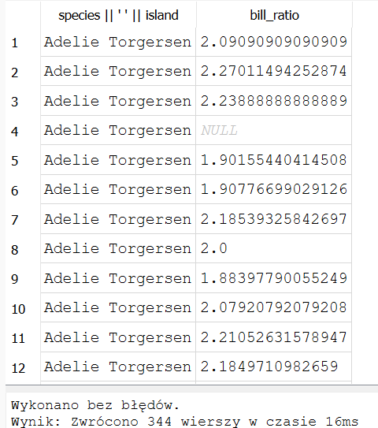

# EXCERCISE-01

> Write a SQL query to select the sex and body mass columns from the little_penguins in that order, sorted such that the largest body mass appears first.

``` 
SELECT sex,body_mass_g FROM little_penguins 
ORDER BY body_mass_g DESC
```


# EXCERCISE-02

> Write a SQL query to select the islands and species from rows 50 to 60 inclusive of the penguins table. Your result should have 11 rows.

``` 
SELECT  species, island FROM penguins
limit 11
OFFSET 49
```


# EXCERCISE-03

> Modify your query to select distinct combinations of island and species from the same rows and compare the result to what you got in part 1.

``` 
SELECT DISTINCT species, island FROM (
SELECT species, island FROM penguins
limit 11
OFFSET 49
)

```


# EXCERCISE-04

> Write a query to select the body masses from penguins that are less than 3000.0 grams.

``` 
SELECT body_mass_g FROM penguins 
WHERE body_mass_g < 3000


```


# EXCERCISE-05

> Write another query to select the species and sex of penguins that weight less than 3000.0 grams. This shows that the columns displayed and those used in filtering are independent of each other.

``` 
SELECT species, sex FROM penguins 
WHERE body_mass_g < 3000

```


# EXCERCISE-06
> Use the not operator to select penguins that are not Gentoos.

```
SELECT * FROM penguins 
WHERE species != "Gentoo"
```


# EXCERCISE-07
> SQL's or is an inclusive or: it succeeds if either or both conditions are true. SQL does not provide a specific operator for exclusive or, which is true if either but not both conditions are true, but the same effect can be achieved using and, or, and not. Write a query to select penguins that are female or on Torgersen Island but not both.

```
SELECT * FROM penguins 
WHERE (island="Torgersen" AND sex !="FEMALE") OR (island!="Torgersen" AND sex="FEMALE")
```


# EXCERCISE-08
> Write a single query that calculates and returns:
> A column called what_where that has the species and island of each penguin separated by a single space.
> A column called bill_ratio that has the ratio of bill length to bill depth.

```
SELECT  
 species || ' ' || island
,bill_length_mm / bill_depth_mm as bill_ratio
FROM penguins
```




# EXCERCISE-09
> Use SQLite's .nullvalue command to change the printed representation of null to the string null and then re-run the previous query. When will displaying null as null be easier to understand? When might it be misleading?

```
.nullvalue null
SELECT species || ' ' || island ,bill_length_mm / bill_depth_mm as bill_ratio FROM penguins;
```


# EXCERCISE-10
> Write a query to find penguins whose body mass is known but whose sex is not.

```
SELECT * FROM penguins
WHERE body_mass_g is NOT NULL AND sex is NULL
```


# EXCERCISE-11
> Write another query to find penguins whose sex is known but whose body mass is not.

```
SELECT * FROM penguins
WHERE body_mass_g is NULL AND sex is Not NULL
```


# EXCERCISE-12
> What is the average body mass of penguins that weight more than 3000.0 grams?

```
SELECT AVG(body_mass_g) as average_body_mass
FROM (SELECT body_mass_g FROM penguins WHERE body_mass_g > 3000)
```


# EXCERCISE-13
> How many different body masses are in the penguins dataset?

```
SELECT COUNT(body_mass_g)
FROM(SELECT DISTINCT body_mass_g FROM penguins WHERE body_mass_g )
```


# EXCERCISE-14
> Write a query that shows each distinct body mass in the penguin dataset and the number of penguins that weigh that much.

```
SELECT DISTINCT COUNT(body_mass_g), body_mass_g
FROM penguins
GROUP BY body_mass_g
```


# EXCERCISE-15
> Write a query that uses filter to calculate the average body masses of heavy penguins (those over 4500 grams) and light penguins (those under 3500 grams) simultaneously. Is it possible to do this using where instead of filter?

```
select
    round(
        avg(body_mass_g) filter (where body_mass_g > 4500.0),
        1
    ) as heavy_penguins,
	round(
        avg(body_mass_g) filter (where body_mass_g < 3500.0),
        1
    ) as light_penguins
from penguins
```


